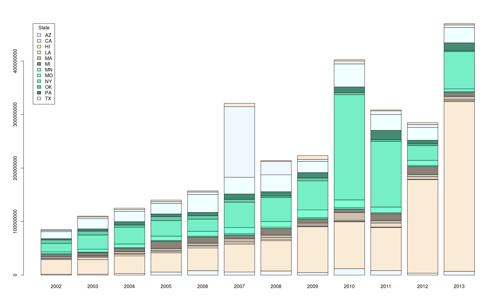

# p4p
Open source tools for parsing and processing CATS data.

# Getting Started
These instructions as written for getting started using Ubuntu Linux. If you’re a Windows user, you might consider [running Ubuntu as a guest virtual machine](http://linus.nci.nih.gov/bdge/installUbuntu.html) on your laptop.

## Prerequisites
You will need to install a few open-source tools in order to use the p4p library.

The source code is managed using [Git](https://git-scm.com):

`$ sudo apt-get install git`

For building the code, we use the [Maven](https://maven.apache.org) build system:

`$ sudo apt-get install maven`

The code is written in Java. We require Java 7, which is the default in recent Linux distributions:

`$ sudo apt-get install default-jdk`

For munging data, we use [Google Protocol Buffers](https://developers.google.com/protocol-buffers). Protos describe structured data, and the protobuf compiler generates source code from data structure definitions:

`$ sudo apt-get install protobuf-compiler`

The default build configuration expects the protobuf compiler at /usr/bin/protoc. If it's installed elsewhere, you can tweak this in the Maven config (pom.xml) once you get the code.

We export data to [SQLite3](https://www.sqlite.org) format. SQLite is a popular open-source database used for data analysis, and most statistical tools can read direct from SQLite format:

`$ sudo apt-get install sqlite3`

The [R Project](https://www.r-project.org) is an open-source statistics package used in the examples below:

`$ sudo apt-get install r-base`

We require R version 3.1 or above. I needed to [upgrade from v3.0](http://stackoverflow.com/questions/27272149/update-r-version-from-3-0-3-to-3-1-2), which comes by default with Ubuntu 14.04.

## Get the Data
The CATS data comes from the Department of Justice via FOIA request.

There is a version of the data from March 2016 [available as a ZIP archive](https://drive.google.com/file/d/0BzVokAd-QgH6RHpnM2pSQU1vYWc/view?usp=sharing). The archive contains CSV files named according to tables from the database extract:

```
$ unzip -l ij_cats_data_20160315.zip

  Length      Date    Time    Name
---------  ---------- -----   ----
      391  2016-03-20 11:06   ABCLAIM_T.txt
      683  2016-03-20 11:06   ABDECLAR_T.txt
       57  2016-03-20 11:06   ABND_CL_DCSN_L.txt
…
      251  2016-03-20 11:08   VIOL_SBSCTN_L.txt
      102  2016-03-20 11:08   VSL_ENGN_MNT_L.txt
      101  2016-03-20 11:08   WT_UNT_L.txt
---------                     -------
3512971989                     280 files
```

The zipped data weighs in at 450 MB (with an 85% compression ratio).

The [database schema](https://drive.google.com/file/d/0BzVokAd-QgH6VkltN0JvbTZhaEU/view?usp=sharing) is available in PDF format.

## Get the Code
Clone the git repository to your development machine:

`$ git clone https://github.com/openjohn/p4p`

This will create the p4p directory and populate it with the source code. Inside you should see the LICENSE (Apache 2.0) and README files, the Maven config (pom.xml), as well as subdirectories with the source code.

## Build the Executable
From the p4p directory, execute the Maven package command:

`$ mvn package`

This will compile the Java code, execute the unit tests, and package everything into a self-contained Java binary package called `p4p-0.2-SNAPSHOT-jar-with-dependencies.jar`.

The JAR will be located in the target subdirectory, which is where all Maven build output goes.

If the packaging succeeds, you should see a `BUILD SUCCESS` message in the output.

## Load the data into SQLite
The CATS parser reads the data from the ZIP archive and exports to a SQLite3 database:

```bash
$ java -cp target/p4p-0.2-SNAPSHOT-jar-with-dependencies.jar \
    org.ij.p4p.cats.CatsParser \
    ij_cats_data_20160315.zip \
    cats_20160315.db
```

The import produces some parse information:

```
20769 { type: INVALID_FIELD_VALUE table_id: 1 field_id: 41 field_value: "U" }
74 { type: BATCH_RECORDS table_id: 1 record_count: 10000 }
70 { type: BATCH_RECORDS table_id: 2 record_count: 10000 }
1 { type: BATCH_RECORDS table_id: 1 record_count: 3752 }
1 { type: BATCH_RECORDS table_id: 2 record_count: 813 }
```
Here’s some help with interpreting the output:
+ For 20769 records from the Asset table, the Lien Exists Flag has a value of U (which means unknown, but valid boolean values are restricted to Y and N). These fields are set to null in the output record.
+ The BATCH_RECORDS type is a special record from which we can calculate counts of parsed records by type:
  + 74 * 10000 + 3752 = 743752 asset records
  + 70 * 10000 + 813 = 700813 equitable sharing records

We can compare the parse counts to the (unzipped) CSV files (line count should be record count + 1 header row):

```
$ wc --lines ASSET_T.txt DAG71_T.txt 
   743753 ASSET_T.txt
   700814 DAG71_T.txt
```

## Open the SQLite Database
Now we can explore the data using an SQL interface:

`$ sqlite3 cats_20160315.db`

If you're new to the SQLite command line interface, try the help command:

```
sqlite> .help
```

Display the tables in the database:

```
sqlite> .tables
asset             equitable_sharing
```

Verify the record counts that we computed above:

```
sqlite> select count(*) from asset;
743752

sqlite> select count(*) from equitable_sharing;
700813
```

Verify that the master assets table has a record for each equitable sharing record:

```
sqlite> select count(*) from asset a
        join equitable_sharing b on a.asset_id = b.asset_id;
700813
```

Turn on pretty printing of the query results:

```
sqlite> .headers on
sqlite> .mode column
```

Roll up the equitable sharing data by year:

```
select
  substr(a.sharing_execution_date, 1, 4) as YR,
  sum(b.asset_value_at_seizure) as AVAS,
  sum(b.asset_value) as AV,
  sum(a.income_available_for_sharing) as IAFS,
  sum(a.income_available_for_sharing * a.percent_to_share / 100.0) as PTSA, 
  sum(a.sharing_execution_amount) as SEA
from equitable_sharing a
join asset b on
  a.asset_id = b.asset_id
where a.sharing_execution_amount > 0
group by YR;
                               
YR          AVAS        AV          IAFS        PTSA        SEA       
----------  ----------  ----------  ----------  ----------  ----------
1979        8405.0      8405.0      8405.0      279.8865    275.09    
1980        318240.0    318240.0    318240.0    60273.7     58625.05  
1987        40966.0     40966.0     40966.0     2296.6      2275.0    
1990        8500.0      8500.0      8500.0      595.0       584.92    
1996        80785.0     80785.0     69454.0     5399.7675   5253.66   
1997        191153196.  190303305.  185135481.  47804099.5  46873457.3
1998        808948878.  781758935.  750613697.  160424993.  153523081.
1999        1243463870  1198417721  1155300340  220000113.  209093337.
2000        1252801643  1180431522  1107352877  227192299.  216727243.
2001        3710608975  2474702374  2405570016  273134030.  258215830.
2002        1057501520  993124638.  949406231.  195819588.  184983418.
2003        1407206495  1342483760  1289188781  249308607.  236647744.
2004        1707611412  1609840550  1499258102  270972867.  257059556.
2005        2286931171  1949207826  1887748073  314439719.  286927298.
2006        2352842012  2214512003  2136896822  370055947.  352852974.
2007        3676965405  3549707302  3442234201  533059990.  516747219.
2008        2973789155  2804633493  2669088754  457348752.  432205140.
2009        3236786124  3198536607  3085044955  430140650.  410473150.
2010        4952163697  4805231249  4698197180  632804167.  609230601.
2011        4656494767  4506643960  3517320580  574819480.  555417330.
2012        7541675192  7440147069  7351522561  565498482.  531890341.
2013        6884775946  6755481325  6683128267  1156548297  720311416.
2014        6205967929  6077144645  4640356619  324834904.  301672859.
```

Notice that the asset values are monotonically decreasing from left to right:
* the value at seizure,
* the depreciated value at present,
* the income available for sharing,
* the estimated sharing amount based on the sharing percentage, and
* the actual sharing execution amount as recorded.

## Make a Plot from the Data
Let's make a plot of the CATS data using R:

```
$ R
```

Install R packages that we will need:

```
> install.packages('RSQLite')
> install.packages('reshape')
```

Open the SQLite database from R:

```
> library("RSQLite")
Loading required package: DBI
> con = dbConnect(RSQLite::SQLite(), "cats_20160315.db")
> dbListTables(con)
[1] "asset"            "equitable_sharing"
```

Replicate the analysis in Figure 3, Annual State Forfeiture Revenues, from [Policing for Profit 2e](http://ij.org/report/policing-for-profit):

```
> fig3 = dbGetQuery(con,"select
    substr(a.sharing_execution_date, 1, 4) as YR,
    b.seizure_state as ST,
    sum(a.sharing_execution_amount) as SEA
  from equitable_sharing a
  join asset b on
    a.asset_id = b.asset_id
  where a.sharing_execution_amount > 0 and
    b.seizure_state in (
      'AZ', 'CA', 'HI', 'LA', 'MA', 'MI', 'MN',
      'MO', 'NY', 'OK', 'PA', 'TX', 'VA', 'WA') and
    YR >= '2002' and YR <= '2013'
  group by YR, ST")
```

This produces a data frame with the query results. Now convert this to a pivot table:

```
> library("reshape")
> pivoted = cast(fig3, YR ~ ST)
```

Make a stacked bar graph from the pivot table:

```
> fill_colors = colours()[2:13]
> legend_values = colnames(pivoted)[2:13]
> options(scipen=20)
> barplot(t(as.matrix(pivoted)), col=fill_colors)
> legend("topleft", legend=legend_values, title="State", inset=c(0.02,0), fill=fill_colors)
```



